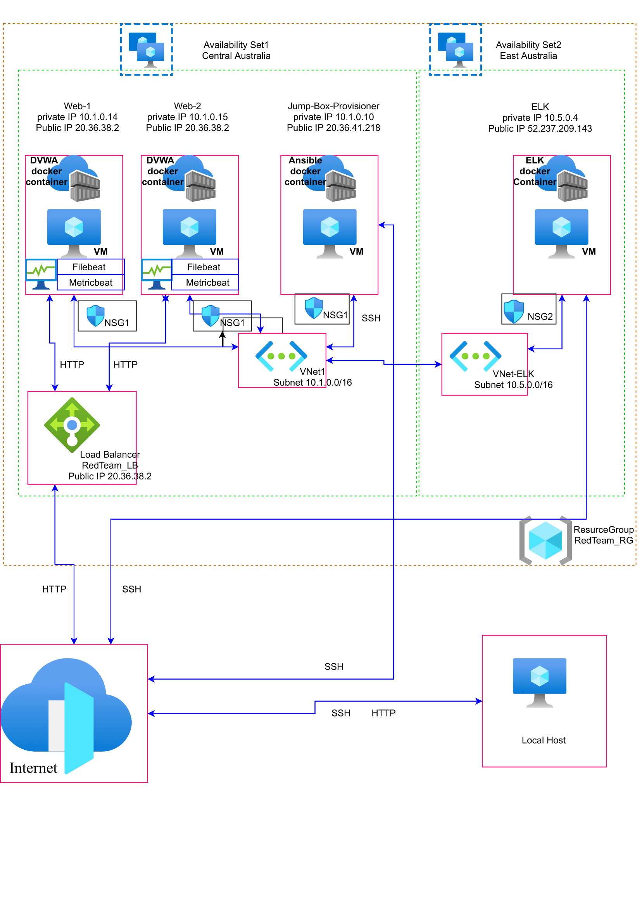
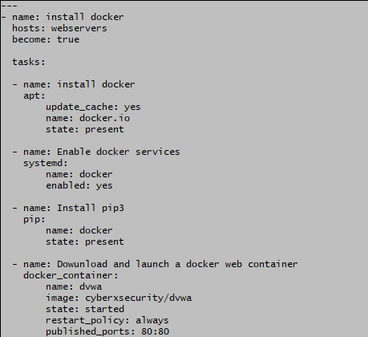
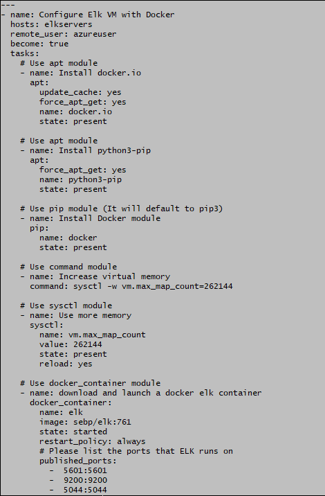
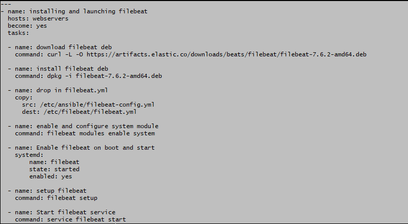
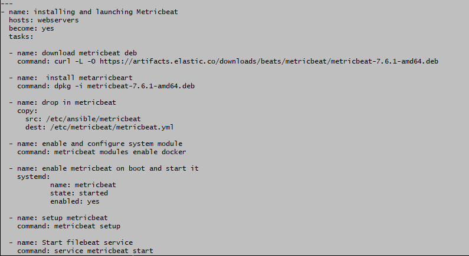
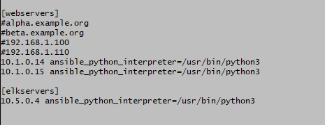

## Automated ELK Stack Deployment

The files in this repository were used to configure the network depicted below.

These files have been tested and used to generate a live ELK deployment on Azure. They can be used to either recreate the entire deployment pictured above. Alternatively, select portions of the playbook file may be used to install only certain pieces of it, such as Filebeat.

playbook to install webservers 

Playbook to install ELK server

Playbook to install filebeat 

Playbook to install metricbeat

This document contains the following details:
- Description of the Topologu
- Access Policies
- ELK Configuration
  - Beats in Use
  - Machines Being Monitored
- How to Use the Ansible Build

### Description of the Topology

The main purpose of this network is to expose a load-balanced and monitored instance of DVWA, the D*mn Vulnerable Web Application.

Load balancing ensures that the application will be highly available, in addition to restricting access to the network.
Load balancer is to ensure that service avalibilty by dividing the traffic. By adding a jumpbox we contol the access to webservers and making thing easier to maintain.

Integrating an ELK server allows users to easily monitor the vulnerable VMs for changes to the configuration and system files.
Filebeat watch for the system logs and send to the elk server
Metricbeat watch for the system information such as cpu usage memory disk space etc.

The configuration details of each machine may be found below.

| Name     | Function | IP Address | Operating System |
|----------|----------|------------|------------------|
| Jump Box | Gateway  | 10.1.0.10  | Linux            |
| Web-1    | DVWA     | 10.1.0.14  | Linux            |
| Web-2    | DVWA     | 10.1.0.15  | Linux            |
| ELK      | ELK      | 10.5.0.4   | Linux            |

### Access Policies

The machines on the internal network are not exposed to the public Internet. 

Only the jump box machine can accept connections from the Internet. Access to this machine is only allowed from the following IP addresses:
- 14.202.219.126

Machines within the network can only be accessed by Jump box.
- The Jump Box can access the ELK VM Elk-1 using SSH. The Jump Box's IP address is 10.1.0.10

A summary of the access policies in place can be found in the table below.

| Name     | Publicly Accessible | Allowed IP Addresses |
|----------|---------------------|----------------------|
| Jump Box | Yes(SSH)            | 14.202.219.126       |
| Web-1    | Yes(HTTP)           | 14.202.219.126       |
| Web-2    | Yes(HTTP)           | 14.202.219.126       |
| ELK      | Yes(SSH)            | 14.202.219.126       |

### Elk Configuration

Ansible was used to automate configuration of the ELK machine. No configuration was performed manually, which is advantageous because...

- Build and deployment is performed automatically, consistently and quickly
- Consistent, rapid configuration and depoloyment of virtual machines ensure all prescribed security meaures can be scripted to minimise attack surfaces while enabling horizontal and elastic scaling by deployment to more or fewer virtual machines in a cluster as required to meet capacity demand.
- Facilitates OS and software updates

The playbook implements the following tasks:

- Installs Docker
- Installs Python
- Installs Docker's Python Module
- Downloads and launches the DVWA Docker container
- Enables the Docker service

The following screenshot displays the result of running `docker ps` after successfully configuring the ELK instance.

### Target Machines & Beats
This ELK server is configured to monitor the following machines:
- Web-1: 10.1.0.14
- Web-2: 10.1.0.15

We have installed the following Beats on these machines:
- Filebeat
- Metricbeat

These Beats allow us to collect the following information from each machine:
- Filebeat collects and ships (sends to ELK for collation, persistence and reporting) logs from VMs running the Filebeat agent
- Metricbeat collects and ships system metrics from the operating system and services of VMs running the Metricbeat

### Using the Playbook
In order to use the playbook, you will need to have an Ansible control node already configured. Assuming you have such a control node provisioned: 

SSH into the control node and follow the steps below:
- Copy the Playbook file to Ansible Docker Container.
- Update the Ansible hosts file to include...
- Run the playbook, and navigate to /etc/ansible/hosts to check that the installation worked as expected.

- Playbook files
    - Install_webservers.yml
    - Install_elk.yml
    - Install_filebeat.yml
    - Install_metricbeat.yml
    
- Playbook run commands
    - ansible webservers -m command -a "cd /etc/ansible/" 
    - ansible-playbook install_filebeat.yml
    - ansible-playbook install_metricbeat.yml 

    - ansible elkservers -m command -a "cd /etc/ansible/"
    - ansible-playbook install_elk.yml 
    
- ELK server Kibana dashboad can be access by following link
    - http://<elk-server-ip>:5601/app/kibana

- Copy playbook to remoteservers command
    - ansible webservers -m copy -a "src=~/Documents/Install_filebeat.yml dest=/etc/ansible/Inatall_filebeat.yml"
- Update remoteservers command
    - ansible webservers -m command -a "sudo upgrade && sudo update"
